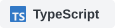
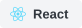
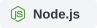

<h1 align="center">Sooyeon Lee</h1>

  <strong>Full-stack Developer · Data</strong> 
  I build practical services from structured data.

  

<h3 align="center">Tech Stack</h3>

  <strong>Languages</strong>  
  
  
  

  <strong>Web</strong>  
  
  
  

  <strong>Database</strong>  
  

<h3 align="center">Contact</h3>

  <a href="mailto:dltndus01226@naver.com">Email ↗</a>

