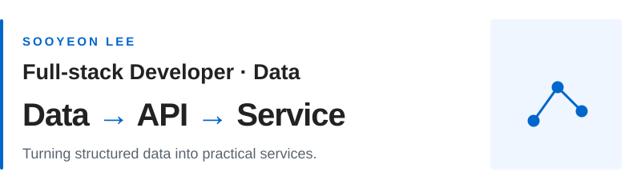

<picture>
  <source media="(prefers-color-scheme: dark)" srcset="./assets/profile-hero-dark.svg" />
  <source media="(prefers-color-scheme: light)" srcset="./assets/profile-hero-light.svg" />
  
</picture>

  
  &nbsp;&nbsp; <a href="mailto:dltndus01226@naver.com">Email ↗</a>

### Selected Projects

<h3> &nbsp;TrendRadar</h3>

<strong>DATA PIPELINE · FULL STACK</strong>

RSS news collection and keyword trend analysis.

Python · MongoDB · Express · React

[Live Demo ↗](https://trend-radar-sandy.vercel.app/) &nbsp; · &nbsp; [GitHub ↗](https://github.com/sooyeon-26/trend-radar)

<h3> &nbsp;SpendFlow</h3>

<strong>MOBILE WEB</strong>

Mobile-first expense tracking with a water-level budget display.

TypeScript · React · Zustand

[Live Demo ↗](https://spend-flow-eight.vercel.app/) &nbsp; · &nbsp; [GitHub ↗](https://github.com/sooyeon-26/SpendFlow)

<h3> &nbsp;타도될까</h3>

<strong>DATA VISUALIZATION</strong>

Hourly boarding charts built from monthly Seoul bus data.

Python · Express · React

[Live Demo ↗](https://transport-service-omega.vercel.app/) &nbsp; · &nbsp; [GitHub ↗](https://github.com/sooyeon-26/transport-service)

### Stack

Python · JavaScript · TypeScript 
React · Node.js · Express · MongoDB
